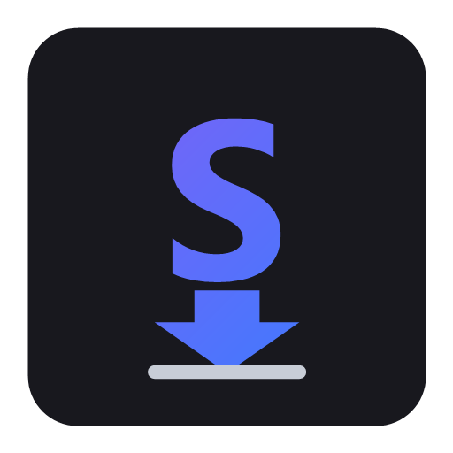

<div align="center">



# Scachalka

**Скачивай легко** — a fast, native Windows GUI that puts the full power of **yt-dlp** and **FFmpeg** behind a modern interface.

[](../../actions/workflows/ci.yml)


English · [Русский ниже](#по-русски)

</div>

---

Scachalka never reimplements downloader logic — it orchestrates your locally installed
yt-dlp and FFmpeg through process execution, with a clean, crash-resistant UI.

## Features

**Downloading**
- Paste one or many URLs (space/newline separated), drag & drop, `Ctrl+Shift+V` paste-and-add
- URL validation up front — garbage never reaches the process layer
- **Playlists**: one toggle downloads whole playlists into `<playlist>/NN - title` subfolders
- Download queue with bounded parallelism (2 by default)
- Per-item progress bar, speed, ETA, size and stage (metadata → downloading → merging → converting)
- Cancel (kills the whole yt-dlp/ffmpeg process tree, cleans up `*.part` files) and retry

**Formats**
- Video: **MP4**, **MKV** with quality cap: Best / 4K / 1440p / 1080p / 720p / 480p / 360p
- Audio: **MP3, M4A, OPUS, FLAC, WAV** — best source audio, converted by FFmpeg

**Full yt-dlp power (Advanced panel)**
- Embed metadata & chapters, thumbnail (cover art), subtitles with language selection
- **Cookies from your browser** (Chrome/Edge/Firefox/Brave/Opera/Vivaldi) for private,
  age-restricted or member-only videos
- **Extra yt-dlp arguments** field — anything yt-dlp can do (`--limit-rate`, `--proxy`,
  `--live-from-start`, SponsorBlock, …); appended last, so it overrides any default

**Comfort**
- **Bilingual UI (English / Русский)** with instant runtime switch, auto-detected from the OS
- Dark and light theme (dark by default, runtime switch, dark title bar on Win11)
- Log window + session log files in `%APPDATA%\Scachalka\logs`
- Open destination folder / reveal downloaded file in Explorer
- Unicode-safe file names; friendly localized error messages
- Settings persisted as JSON (folder, format, quality, theme, language, all advanced options)

## Requirements

| Requirement | Notes |
|---|---|
| Windows 10/11 x64 | |
| [yt-dlp](https://github.com/yt-dlp/yt-dlp) | `winget install yt-dlp.yt-dlp` |
| [FFmpeg](https://ffmpeg.org) | `winget install Gyan.FFmpeg` (or bundled with the yt-dlp winget package) |
| .NET 8 SDK | **Build only** — the published exe is self-contained |

Scachalka finds the tools automatically: next to `Scachalka.exe` → `tools\` subfolder →
every `PATH` entry → WinGet links. If they are missing, a banner explains what to install;
press **Re-check tools** afterwards.

## Download & run (users)

1. Grab `Scachalka.exe` from the [latest release](../../releases/latest).
2. Install yt-dlp and FFmpeg (see Requirements).
3. Run `Scachalka.exe` — no installer, no admin rights. Settings live in `%APPDATA%\Scachalka\`.

## Build from source (developers)

```powershell
git clone https://github.com/OWNER/scachalka.git
cd scachalka
dotnet publish -c Release -r win-x64 --self-contained true
```

Portable single-file executable:

```
src\YtDlpGui.App\bin\Release\net8.0-windows\win-x64\publish\Scachalka.exe
```

Run tests:

```powershell
dotnet test
```

## Releases (maintainers)

Tag a version and CI builds and publishes the portable exe automatically:

```bash
git tag v1.1.0
git push origin v1.1.0
```

The [release workflow](.github/workflows/release.yml) runs tests, publishes the
self-contained exe, and attaches `Scachalka.exe` + a zip to a GitHub Release.

## Logo / icon

The app icon lives at `assets/scachalka.ico` and is generated from `assets/logo.png` by
[`tools/generate-icon.ps1`](tools/generate-icon.ps1). To use your own artwork, replace
`assets/logo.png` with a square PNG and re-run:

```powershell
pwsh tools/generate-icon.ps1
```

Both the executable icon and the window icon pick it up on the next build.

## Architecture

Clean layered architecture with strictly one-directional dependencies:

```
YtDlpGui.App            composition root: DI wiring, app lifecycle
  ├─ YtDlpGui.UI            WPF views, view models (MVVM), themes, localization, converters
  │    └─ YtDlpGui.Application   queue coordinator, download executor, job model
  │         └─ YtDlpGui.Core          URL validation, argument-builder strategies,
  │              │                    progress parser, error classifier, retry policy
  │              └─ YtDlpGui.Abstractions   interfaces, models, localization contract
  └─ YtDlpGui.Infrastructure  process runner (kill-tree), tool locator,
                              JSON settings, logging, string catalogs
```

- **Strategy pattern for formats** (`IArgumentBuilder`) — new formats add a class, not edits.
- **Machine-readable progress** via `--progress-template` with a resilient fallback parser.
- **Injection-proof process execution**: `ArgumentList` + `--` terminator, no shell.
- **Cancellation kills the entire process tree** and removes `*.part` leftovers.
- **UI never blocks**: async IO, throttled progress, collections mutated only on the UI thread.

See [CONTRIBUTING.md](CONTRIBUTING.md) for the full module guide.

## Legal

Scachalka is a general-purpose GUI wrapper for yt-dlp. Use it only for content you are
allowed to download. It intentionally does **not** include features whose sole purpose is
to bypass site access controls (anti-bot, DRM) or to enable copyright infringement.

## License

[MIT](LICENSE)

---

<a name="по-русски"></a>

## По-русски

**Scachalka** — быстрый нативный GUI для Windows поверх **yt-dlp** и **FFmpeg**. Логику
скачивания не переписывает — запускает уже установленные инструменты через процессы.

**Возможности:** много ссылок сразу, drag & drop, плейлисты, форматы MP4/MKV и
MP3/M4A/OPUS/FLAC/WAV, выбор качества, очередь с параллельностью, прогресс/скорость/ETA/этап,
отмена и повтор, встраивание метаданных/обложки/субтитров, cookies из браузера, поле
произвольных аргументов yt-dlp, тёмная/светлая тема, **двуязычный интерфейс (RU/EN)** с
мгновенным переключением, журнал.

**Требования:** Windows 10/11 x64; установленные yt-dlp и FFmpeg
(`winget install yt-dlp.yt-dlp Gyan.FFmpeg`). Для запуска готового exe .NET не нужен.

**Запуск:** скачайте `Scachalka.exe` из [релизов](../../releases/latest), установите yt-dlp и
FFmpeg, запустите. Установщик не требуется, настройки — в `%APPDATA%\Scachalka\`.

**Сборка:**

```powershell
dotnet publish -c Release -r win-x64 --self-contained true
```

**Свой логотип:** замените `assets/logo.png` своим квадратным PNG и выполните
`pwsh tools/generate-icon.ps1`.

**Важно:** программа предназначена только для контента, который вам разрешено скачивать.
Функций для обхода защит сайтов (anti-bot, DRM) в ней нет и не будет.
