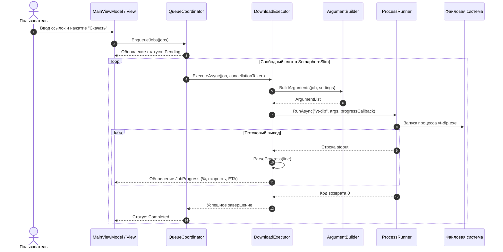

# Архитектура проекта Scachalka (YtDlpGui)

## 1. Обзор архитектуры

Проект **Scachalka** спроектирован с соблюдением принципов **Чистой архитектуры (Clean Architecture)** и **SOLID**. Зависимости между слоями строго однонаправленные — от внешних реализаций (UI, Infrastructure) к внутреннему ядру (Core, Abstractions).

```
                      ┌───────────────────────┐
                      │      YtDlpGui.App     │  (Composition Root / DI)
                      └───────────┬───────────┘
                                  │
         ┌────────────────────────┴────────────────────────┐
         ▼                                                 ▼
┌───────────────────┐                             ┌───────────────────┐
│    YtDlpGui.UI    │ (WPF, MVVM, Views, VMs)     │YtDlpGui.Infrastr. │ (Process, OS,
└────────┬──────────┘                             └─────────┬─────────┘  Settings, Logs)
         │                                                  │
         ▼                                                  │
┌───────────────────────────┐                               │
│    YtDlpGui.Application   │ (Queue, Executor, Use Cases)  │
└────────┬──────────────────┘                               │
         │                                                  │
         ▼                                                  │
┌───────────────────────────┐                               │
│      YtDlpGui.Core        │ (Domain Logic, Parsers, Match)│
└────────┬──────────────────┘                               │
         │                                                  │
         └────────────────────┬─────────────────────────────┘
                              ▼
                 ┌───────────────────────────┐
                 │   YtDlpGui.Abstractions   │ (Interfaces, Enums, DTOs)
                 └───────────────────────────┘
```

---

## 2. Разделение по слоям и модулям

### 2.1. `YtDlpGui.Abstractions`
Фундаментальный слой контрактов. Не зависит от внешних библиотек и других проектов решения.
- **Интерфейсы сервисов:**
  - `IProcessRunner` — контракт на безопасное выполнение системных процессов с потоковым перехватом stdout/stderr и отменой.
  - `IDownloadExecutor` — управление полным циклом загрузки одного задания.
  - `IQueueCoordinator` — управление очередью задач с ограничением конкурентности.
  - `IArgumentBuilder` — генерация безопасного списка аргументов для yt-dlp.
  - `ISongMatchScorer` — вычисление коэффициента уверенности соответствия трека.
  - `ILinkSource` — контракт для парсинга источников ссылок (CSV, JSON, TXT).
  - `ISettingsService` — сохранение и загрузка настроек приложения.
  - `ILocalizationService` — управление языковыми ресурсами.
- **Доменные модели и DTO:** `DownloadJob`, `JobProgress`, `SongMetadata`, `MatchResult`, `ToolCheckResult`.
- **Перечисления (Enums):** `DownloadStage`, `JobStatus`, `OutputFormat`, `VideoQuality`, `BrowserCookieSource`.

### 2.2. `YtDlpGui.Core`
Чистая бизнес-логика. Слой полностью изолирован от дискового ввода-вывода (I/O), сетевых вызовов и графического интерфейса, благодаря чему покрыт **168 модульными тестами**.
- **`Matching` (Алгоритм сопоставления Apple Music):**
  - Очистка и нормализация строк (удаление спецсимволов, нормализация регистра, диакритики).
  - Вычисление сходства названий и артистов (алгоритмы расстояния Левенштейна и Джаро — Винклера).
  - Эвристический скоринг по метаданным: штрафы за нежелательные модификации (`nightcore`, `slowed + reverb`, `bass boosted`, `remix`, `karaoke`, `instrumental`, `cover`, `live`, `AI`).
  - Бонусы за официальные каналы (`Official Audio`, `Official Music Video`, VEVO, топик-каналы YouTube Music `- Topic`).
  - Сопоставление длительности трека с жесткими допусками.
- **`Arguments` (Генераторы аргументов yt-dlp):**
  - Паттерн **Strategy** для форматов аудио (`MP3`, `M4A`, `OPUS`, `FLAC`, `WAV`) и видео (`MP4`, `MKV`).
  - Безопасное разделение аргументов для предотвращения инъекций команд через командную строку.
  - Поддержка встраивания метаданных, обложек, субтитров и чтения cookie из браузеров.
- **`Progress` (Парсер прогресса):**
  - Двухуровневый парсер: приоритетный парсинг шаблона `--progress-template` и адаптивный fallback-парсер на базе регулярных выражений для нестандартных выводов yt-dlp.
- **`Links` & `Library` (Парсинг входных данных):**
  - Потоковый парсинг Apple Music экспортов (TSV UTF-8/UTF-16 с поддержкой заголовков на русском и английском языках).
  - Анализ ссылок YouTube (поддержка `youtube.com/watch?v=`, `youtu.be/`, `music.youtube.com`, `m.youtube.com`), нормализация до канонического ID видео для отсева дубликатов.
- **`Errors` & `Retry`:**
  - Классификатор ошибок (ошибки авторизации, закрытый доступ, сетевые тайм-ауты, блокировка базы cookies браузера).
  - Политика автоматического повтора (auto-retry без cookies при ошибке `database is locked`).

### 2.3. `YtDlpGui.Infrastructure`
Реализация взаимодействия с операционной системой и внешними утилитами.
- **`Processes/ProcessRunner`:**
  - Исполнение процессов через `ProcessStartInfo.ArgumentList` (гарантирует невозможность Shell Injection).
  - Потоковое асинхронное чтение `StandardOutput` и `StandardError` без взаимных блокировок (deadlocks).
  - Полное завершение дерева дочерних процессов при отмене (`taskkill /T /F` и Job Objects Windows).
  - Очистка временных файлов загрузки (`*.part`, `*.ytdl`) при прерывании пользователем.
- **`Tools/ToolLocator` & `ToolUpdater`:**
  - Автоматическое обнаружение `yt-dlp.exe` и `ffmpeg.exe` по цепочке: локальная папка `tools/` → директория приложения → системный `PATH` → WinGet.
  - Возможность обновления бинарных утилит в один клик.
- **`Settings/JsonSettingsService`:**
  - Асинхронная сериализация пользовательских параметров в `%APPDATA%\Scachalka\settings.json`.
- **`Logging/FileLogger`:**
  - Потокобезопасная запись сессионных логов для диагностики.

### 2.4. `YtDlpGui.Application`
Оркестрация сценариев использования (Use Cases).
- **`Queue/QueueCoordinator`:**
  - Планировщик очереди на основе `SemaphoreSlim` с настраиваемым лимитом параллельных потоков.
  - Потокобезопасные переходы состояний (`Pending` → `Running` → `Completed` / `Failed` / `Cancelled`).
- **`Execution/DownloadExecutor`:**
  - Жизненный цикл отдельной загрузки: подготовка каталогов, сборка аргументов, запуск через `IProcessRunner`, трансляция прогресса и этапов (`Downloading`, `Merging`, `Converting`).
- **`Import` (Оркестрация импорта):**
  - Фоновый поиск треков через вызов `ytsearch10:` с парсингом JSON-метаданных без скачивания медиа.
  - Формирование отчетов об ошибках (`failed_songs.txt`, `failed_links.txt`).

### 2.5. `YtDlpGui.UI`
Презентационный слой на базе **WPF (.NET 8)** с паттерном **MVVM (Model-View-ViewModel)**.
- **Data Binding & Commands:** Двустороннее связывание данных через `INotifyPropertyChanged` и реализацию `IRelayCommand`.
- **Локализация:** Мгновенное переключение языка интерфейса (Русский / Английский) на лету без перезапуска приложения с использованием динамических ресурсов XAML (`DynamicResource`).
- **Темы оформления:** Динамическое переключение Light / Dark тем, интеграция с Windows 11 DWM API (`DwmSetWindowAttribute`) для темной рамки окна.
- **Отзывчивость UI:** Все фоновые операции выполняются в пуле потоков через `async/await`, мутации коллекций UI выполняются через `Dispatcher`.

### 2.6. `YtDlpGui.App`
Точка входа приложения (Composition Root).
- Настройка контейнера внедрения зависимостей (`Microsoft.Extensions.DependencyInjection`).
- Глобальная обработка необработанных исключений (`DispatcherUnhandledException`, `AppDomain.UnhandledException`).
- Управление жизненным циклом и закрытием приложения с корректным завершением активных задач.

---

## 3. Диаграмма последовательности загрузки



---

## 4. Безопасность и отказоустойчивость

1. **Защита от Shell Injection:** Запуск дочерних процессов производится без использования интерпретатора командной строки (`UseShellExecute = false`). Передача аргументов осуществляется исключительно через строго типизированную коллекцию `ProcessStartInfo.ArgumentList` с экранированием разделителем `--`.
2. **Гарантированная очистка ресурсов:** При отмене задачи прерывается не только корневой процесс, но и всё дерево дочерних процессов (например, вызванный `ffmpeg`). Временные артефакты (`.part`, `.ytdl`) удаляются с диска.
3. **Отказоустойчивость при заблокированных cookies:** Если браузер открыт и блокирует SQLite-файл cookies, приложение не падает с ошибкой, а классифицирует ошибку и автоматически повторяет запрос без cookies.
4. **Валидация на раннем этапе:** Невалидные или поврежденные URL-адреса отсекаются до передачи в процесс, экономя системные ресурсы.
